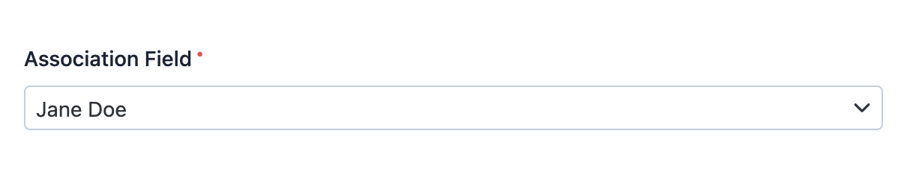

EasyAdmin Association Field
===========================

This field displays the contents of a property used to associate Doctrine entities
with each other (of any type: one-to-one, one-to-many, etc.) In form pages this
field is rendered using an advanced autocomplete widget based on `TomSelect`_ library.

In :ref:`form pages (edit and new) <crud-pages>` it looks like this:

In read-only pages (``index``and ``detail``) is displayed as a clickable link
pointing to the ``detail`` action of the related entity.

Basic Information
-----------------

* **PHP Class**: ``EasyCorp\Bundle\EasyAdminBundle\Field\AssociationField``
* **Doctrine DBAL Type** used to store this value: ``integer``, ``guid`` or any
  other type that you use to store the ID of the associated entity
* **Symfony Form Type** used to render the field: `EntityType`_
* **Rendered as**:

  .. code-block:: html

    <!-- when loading the page this is transformed into a dynamic field via JavaScript -->
    <select> ... </select>

Options
-------

.. _field-association-autocomplete:

``autocomplete``
~~~~~~~~~~~~~~~~

By default, the field loads all the possible values of the related entity. This
creates "out of memory" errors when that entity has hundreds or thousands of values.
Use this option to load values dynamically (via Ajax requests) based on user input::

    yield AssociationField::new('...')->autocomplete();

The ``autocomplete()`` method accepts an optional boolean parameter to enable
or disable the autocomplete feature conditionally. This is useful when you
need to decide at runtime whether to use autocomplete::

    // enable autocomplete only when there are many categories
    $categoryCount = $this->entityManager->getRepository(Category::class)->count([]);
    yield AssociationField::new('category')->autocomplete(enable: $categoryCount > 100);

    // enable based on user role
    yield AssociationField::new('category')->autocomplete(
        enable: $this->isGranted('ROLE_ADMIN')
    );

Customizing Autocomplete Display
.................................

By default, autocomplete fields display entities using their ``__toString()``
method. You can customize this display using either a 1) callback (for simple
text) or a 2) Twig template (for complex HTML).

.. tip::

    If you customize the autocomplete for a given class (for example, ``User``)
    in the same way across different CRUD controllers, you can
    :ref:`configure this globally <crud-autocomplete>` per CRUD and/or Dashboard.

**1) Simple Text Customization (Callback)**

Pass a callback to the ``autocomplete()`` method to customize how entities
appear in the dropdown. This is useful for adding extra information::

    use EasyCorp\Bundle\EasyAdminBundle\Field\AssociationField;

    yield AssociationField::new('city')->autocomplete(
        callback: static fn (City $c): string => sprintf('%s, %s', $c->getName(), $c->getState()->getCode())
    );

You can combine the ``enable`` parameter with other options::

    yield AssociationField::new('city')->autocomplete(
        enable: $cityCount > 50,
        callback: static fn (City $c): string => sprintf('%s, %s', $c->getName(), $c->getState()->getCode())
    );

**2) Complex HTML Customization (Twig Template)**

For more complex displays with HTML markup, use a Twig template. The
template receives the entity as the ``entity`` variable::

    yield AssociationField::new('product')->autocomplete(
        template: 'admin/autocomplete/product.html.twig',
        renderAsHtml: true
    );

Create the template file with your custom HTML::

    {# templates/admin/autocomplete/product.html.twig #}
    

        <strong>{{ entity.name }}</strong>
        ({{ entity.sku }})
        
            Low Stock
        
    

**HTML Rendering and Security**

By default, all output is HTML-escaped for security. This prevents XSS
attacks but means HTML tags will display as text. Use ``renderAsHtml: true``
to allow HTML rendering::

    // escaped output (default, safe)
    yield AssociationField::new('category')->autocomplete(
        template: 'admin/autocomplete/category.html.twig'
    );

    // HTML output (use only with trusted content)
    yield AssociationField::new('product')->autocomplete(
        template: 'admin/autocomplete/product.html.twig',
        renderAsHtml: true
    );

    // callbacks can also generate HTML when combined with ``renderAsHtml``
    yield AssociationField::new('category')->autocomplete(
        callback: static fn ($e): string => '<strong>' . htmlspecialchars($e->getTitle()) . '</strong>',
        renderAsHtml: true
    );

.. caution::

    When ``renderAsHtml`` is ``true``, you must handle escaping yourself
    in the template to prevent XSS attacks.

``renderAsNativeWidget``
~~~~~~~~~~~~~~~~~~~~~~~~

By default, this field is rendered using an advanced JavaScript widget created
with the `TomSelect`_ library. If you prefer to display a standard ``<select>``
element, use this option::

    yield AssociationField::new('...')->renderAsNativeWidget();

``renderAsEmbeddedForm``
~~~~~~~~~~~~~~~~~~~~~~~~

By default, to-one associations are rendered in forms as dropdowns where you can
select one of the given values. For example, a blog post associated with one
author will show a dropdown list to select one of the available authors.

However, sometimes the associated property refers to a `value object`_. For example,
a ``Customer`` entity related to an ``Address`` entity or a ``Server`` entity
related to an ``IpAddres`` entity.

In these cases it doesn't make sense to display a dropdown with all the
(potentially millions!) addresses. Instead, it's better to embed the form fields
of the related entity (e.g. ``Address``) inside the form of the entity that you
are creating or editing (e.g. ``Customer``).

The ``renderAsEmbeddedForm()`` option tells EasyAdmin to embed the CRUD form of
the associated property instead of showing all its possible values in a dropdown::

    yield AssociationField::new('...')->renderAsEmbeddedForm();

EasyAdmin looks for the :doc:`CRUD controller </crud>` associated to the property
automatically. If you need better control about which CRUD controller to use,
pass the fully-qualified class name of the controller as the first argument::

    yield AssociationField::new('...')->renderAsEmbeddedForm(CategoryCrudController::class);

    // the other optional arguments are the page names passed to the configureFields()
    // method of the CRUD controller (this allows you to have a better control of
    // the fields displayed on different scenarios)
    yield AssociationField::new('...')->renderAsEmbeddedForm(
        CategoryCrudController::class, 'create_category_inside_an_article', 'edit_category_inside_an_article'
    );

``renderAsHtml``
~~~~~~~~~~~~~~~~

By default, the HTML contents of the items displayed in the select lists are
escaped to avoid security issues like `XSS`_. If you need to render custom HTML
contents and you are certain that they are safe to display "as is", set this
option to not escape those contents::

    yield AssociationField::new('...')->renderAsHtml();

``setCrudController``
~~~~~~~~~~~~~~~~~~~~~

In read-only pages (``index`` and ``detail``) this field is displayed as a
clickable link that points to the ``detail`` page of the related entity.

By default, EasyAdmin finds the CRUD controller of the related entity automatically.
However, if you define more than one CRUD controller for that entity, you'll need
to use this option to specify which one to use for the links::

    yield AssociationField::new('...')->setCrudController(SomeCrudController::class);

``setPreferredChoices``
~~~~~~~~~~~~~~~~~~~~~~~

Use this option to display certain entities at the top of the dropdown, visually
separated from the rest. This is useful when some entities are more commonly
selected than others::

    // pass an array of entity IDs
    yield AssociationField::new('...')->setPreferredChoices([1, 2, 3]);

    // or pass an array of entity objects
    yield AssociationField::new('...')->setPreferredChoices([$featuredCategory1, $featuredCategory2]);

You can also use a callable that receives the entity and returns ``true`` for
preferred choices::

    yield AssociationField::new('...')->setPreferredChoices(
        static fn (Category $category): bool => $category->isFeatured()
    );

.. note::

    This option is not compatible with the remote autocomplete feature
    (``->autocomplete()``). It only works with the native widget
    (``->renderAsNativeWidget()``) or the local TomSelect widget (default).

``setQueryBuilder``
~~~~~~~~~~~~~~~~~~~

By default, EasyAdmin uses a generic database query to find the items of the
related entity. Use this option if you need to use a custom query to filter results
or to sort them in some specific way.

The value of this option must be a ``callable`` that receives a ``QueryBuilder``
object as its first argument and returns the modified ``QueryBuilder``::

    yield AssociationField::new('...')->setQueryBuilder(
        fn (QueryBuilder $queryBuilder): QueryBuilder => $queryBuilder->andWhere('...')
    );

If you already define custom queries in repository methods, you can reuse them
inside the callable::

    yield AssociationField::new('...')->setQueryBuilder(
        fn (QueryBuilder $queryBuilder): QueryBuilder => $queryBuilder->getEntityManager()->getRepository(Foo::class)->getSomeQueryBuilder();
    );

Alternatively, you can use the `query_builder option`_ of Symfony's
``EntityType``. This is useful when the custom query is short and not reused
elsewhere in the application::

    // get the entity repository somehow (e.g. injecting the entityManager)
    $someRepository = $this->entityManager->getRepository(SomeEntity::class);

    $queryBuilder = $someRepository->createQueryBuilder('entity') // must be called `entity`
        ->where('entity.some_property = :some_value')
        ->setParameter('some_value', '...')
        ->orderBy('entity.some_property', 'ASC');

    yield AssociationField::new('...')->setFormTypeOption('query_builder', $queryBuilder);

setSortProperty
~~~~~~~~~~~~~~~

If you sort the ``index`` page results using an association field, by default
those results are sorted using the ``id`` property of the associated entity.
Set this option to sort results using any of the other properties of the
associated entity::

    yield AssociationField::new('user')->setSortProperty('name');

.. _`TomSelect`: https://tom-select.js.org/
.. _`EntityType`: https://symfony.com/doc/current/reference/forms/types/entity.html
.. _`query_builder option`: https://symfony.com/doc/current/reference/forms/types/entity.html#query-builder
.. _`value object`: https://en.wikipedia.org/wiki/Value_object
.. _`XSS`: https://en.wikipedia.org/wiki/Cross-site_scripting
