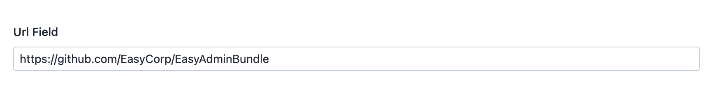

EasyAdmin URL Field
===================

This field is used to represent a text content that stores a single URL.

In :ref:`form pages (edit and new) <crud-pages>` it looks like this:

Basic Information
-----------------

* **PHP Class**: ``EasyCorp\Bundle\EasyAdminBundle\Field\UrlField``
* **Doctrine DBAL Type** used to store this value: ``string``
* **Symfony Form Type** used to render the field: `UrlType`_
* **Rendered as**:

  .. code-block:: html

    <input type="url" value="...">

Options
-------

allowedProtocols
~~~~~~~~~~~~~~~~

Restricts the protocols accepted as valid input by attaching a Symfony
``Url`` constraint to the form field. Pass the protocols without the
trailing colon::

    UrlField::new('homepage')
        ->allowedProtocols(['http', 'https']);

By default no protocol restriction is applied, so any scheme-looking
value (like ``ftp://``, ``ssh://`` or ``mailto:``) is accepted. Use this
option when you know the field should only store web URLs.

Regardless of this option, EasyAdmin always renders known-dangerous
schemes (``javascript:``, ``data:``, ``vbscript:`` and ``file:``) as
plain text instead of clickable links, to prevent stored XSS attacks in
the backend.

setDefaultProtocol
~~~~~~~~~~~~~~~~~~

Defines the protocol prepended to the submitted value when it doesn't
include one. If you don't set it, no protocol is prepended and the field
is rendered using an ``<input type="url">`` element so the browser
validates the value::

    UrlField::new('homepage')
        ->setDefaultProtocol('https');

See the `UrlType default_protocol option`_ for details.

.. _`UrlType`: https://symfony.com/doc/current/reference/forms/types/url.html
.. _`UrlType default_protocol option`: https://symfony.com/doc/current/reference/forms/types/url.html#default-protocol
